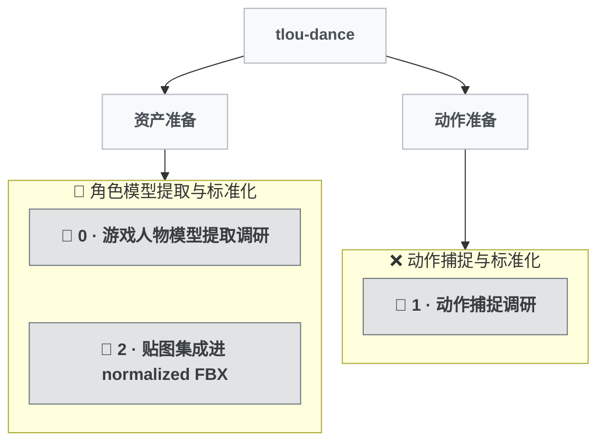

# 开发树

## 分类图例

| 图标 | 类型 | 说明                       |
| ---- | ---- | -------------------------- |
| 🌱   | 初建 | 某功能域首次从零建立       |
| ✨   | 功能 | 扩展用户可感知的能力       |
| 🐛   | 修复 | 纠正缺陷或回归             |
| 🏗️   | 重构 | 内部结构改善，用户行为不变 |
| 📦   | 工程 | 打包/CI/分发/工具链        |
| 🔬   | 探索 | 调研，可能被搁置           |

## 可视化

## 节点索引

> 最后更新：2026-05-19 | 共 3 轮

| #   | 名称                      | 类型    | 所属 Epic            | 一句话描述                                                                                     |
| --- | ------------------------- | ------- | -------------------- | ---------------------------------------------------------------------------------------------- |
| 0   | 游戏人物模型提取调研      | 🔬 探索 | 角色模型提取与标准化 | 三人 fan-port 模型 + Mixamo 65-bone 标准骨架；灰模成品（无贴图）就绪                           |
| 1   | 动作捕捉调研              | 🔬 探索 | 动作捕捉与标准化     | spike 失败：环境与权重就绪、detection+tracking+HMR2 推理通；pyrender 渲染卡死，未交付 SMPL pkl |
| 2   | 贴图集成进 normalized FBX | 🔬 探索 | 角色模型提取与标准化 | spike 失败：pipeline + 41 单测就位，Blender 4.5 不解 TLOU DDS 子格式，未交付贴图               |

## Epic 结构

### 资产准备

#### 角色模型提取与标准化

- 状态：进行中
- 轮次：0, 2

> round 0 spike 已交付灰模成品（mesh + Mixamo 65-bone 标准骨架）；round 2 尝试集成贴图未达成（Blender 4.5 不解 TLOU 的 DDS 子格式），spike 失败但 pipeline 代码与 41 个单测可复用，等 DDS 外部解码方案落地后重启。issue #3 保持 open。

### 动作准备

#### 动作捕捉与标准化

- 状态：已放弃
- 轮次：1

> round 1 spike：环境与权重全部就绪、detection + tracking + HMR2 推理路径通；卡死在 4D-Humans 内置 pyrender 渲染（EGL 在 RTX 4090 + GNOME 反复 reset_render 后 BAD_MATCH，pyglet GLX hang），未拿到 SMPL pkl。issue #2 保留 open 等重启（最快路径：`render.enable=False` 跳过渲染拿 pkl，再用 Blender 自己渲）。
